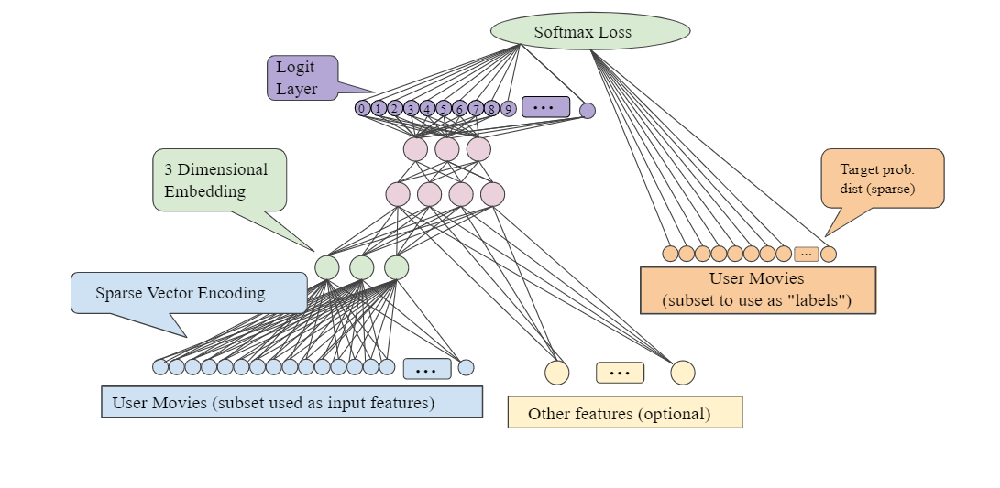

# User_Trip_Recommendation_System

Solving the problem of Flight Booking company on how to recommend trips to user 

# Identifying features for similar trip:

1. Departure date
2. Arrival date ( for two-way)
3. Departure Aiport
4. Arrival Airport
5. Stay
6. Weekend 
7. Non_stop
8. Layover time

 Similarity measures: Minimum Ecludian distance, Cosine Similarity

 Grouping users and finding trip most similar to their previous trips.

# Coming Next:

1.Create example of similar and different trips. 

2.Build these trip features to pass in a Neural Network and predict outcome.

3.Extract hidden layer weights to use as embeddings for trips. 

Using architecture as below:

